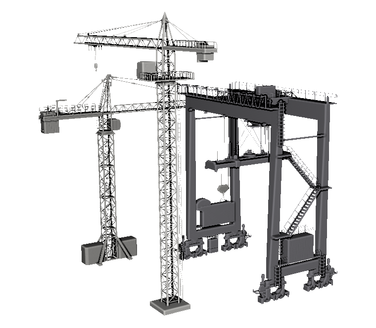

---
#
# By default, content added below the "---" mark will appear in the home page
# between the top bar and the list of recent posts.
# To change the home page layout, edit the _layouts/home.html file.
# See: https://jekyllrb.com/docs/themes/#overriding-theme-defaults
#
layout: home
title: IROS 2024 Cooperative Aerial Robots Inspection Challenge (IROS24-CARIC)
---

# 1. Table of contents

- [1. Table of contents](#1-table-of-contents)
- [2. Introduction](#2-introduction)
- [3. CARIC at IROS 2024](#3-caric-at-iros-2024)
  - [3.1. How to participate?](#31-how-to-participate)
  - [3.2. Important dates](#32-important-dates)
  - [3.3. Prize](#33-prize)
- [4. Installation](#4-installation)
  - [4.1. Install the dependencies](#41-install-the-dependencies)
    - [4.1.1. Ubuntu 20.04 + ROS Noetic](#411-ubuntu-2004--ros-noetic)
    - [4.1.2. Ubuntu 18.04 + ROS Melodic](#412-ubuntu-1804--ros-melodic)
    - [4.1.3. Notes](#413-notes)
  - [4.2. Install the CARIC packages](#42-install-the-caric-packages)
  - [4.3. Run the flight test](#43-run-the-flight-test)
- [5. The benchmark design](#5-the-benchmark-design)
  - [5.1. The UAV fleet](#51-the-uav-fleet)
  - [5.2. Inspection scenarios](#52-inspection-scenarios)
  - [5.3. The benchmark criteria](#53-the-benchmark-criteria)
    - [5.3.1. Inspection mission overview](#531-inspection-mission-overview)
    - [5.3.2. The mission score](#532-the-mission-score)
    - [5.3.3. LOS and FOV](#533-los-and-fov)
    - [5.3.4. Motion blur](#534-motion-blur)
    - [5.3.5. Image resolution](#535-image-resolution)
- [6. Developing your CARI scheme](#6-developing-your-cari-scheme)
  - [6.1. Ground rules](#61-ground-rules)
  - [6.2. Onboard perception data](#62-onboard-perception-data)
  - [6.3. UAV control interface](#63-uav-control-interface)
    - [6.3.1. Camera gimbal control](#631-camera-gimbal-control)
    - [6.3.2. Camera trigger](#632-camera-trigger)
  - [6.4. Communication network](#64-communication-network)
- [7. Baseline Method](#7-baseline-method)
- [8. Organizers](#8-organizers)


# 2. Introduction

Inspection, repair and maintenance is a multi-billion business that is [projected to grow substaintially in the next decade](https://www.fortunebusinessinsights.com/inspection-repair-and-maintenance-market-102983), with integration of automation and AI being the driving force. At its core, the primary goal in an inspection mission is to capture images on the surface of some structures at the best possible quality. However, exploration is also a secondary objective that needs to be addressed to identify the structure and its surface. Oftentimes, bounding box(es) can be set around the target of interest to narrow the area of exploration.

Thanks to their unique mobility, aerial robots have become widely adopted for inspection tasks. We believe that the next breakthrough in this industry shall be delivered by Cooperative Aerial Robots Inspection (CARI) systems. Moreover, in the same spirit of economic specialization, heterogeneous CARI systems has the potential to acheive greater efficiency, quality and versatility compared to single-UAV or homogenous systems.
Nevertheless, to accomplish this vision, novel cooperative strategies that can optimally coordinate the operation of multiple robots remain an open research problem.

To accelerate this development, we introduce the **C**ooperative **A**erial **R**obots **I**nspection **C**hallenge Benchmark, a software stack based on [Gazebo](https://gazebosim.org/home), [RotorS](https://github.com/ethz-asl/rotors_simulator/wiki) and other open-source packages. The objective of CARIC is twofold. First, it aims to faithfully simulate multi-UAV systems operating in [typical real-world inspection missions](#52-inspection-scenarios). Second, based on this tool, different cooperative inspection schemes can be benchmarked based on a [common metric](#53-the-benchmark-criteria). The software stack is made public to benefit the community and we would like to welcome all who are interested to participate in [the challenge to be held at IROS 2024](#3-how-to-participate).

<div style="text-align:center">
  
  <figcaption>CARIC software package can simulate UAV dynamics, physical collisions, camera-FOV-based instance detection, and line-of-sight-only communications</figcaption>
</div>

# 3. CARIC at IROS 2024

## 3.1. How to participate?

The challenge's procedure is as follows:

* Sign up via the following [form](https://docs.google.com/forms/d/e/1FAIpQLSfpaBQUJmdi6etYXH5t0bj7R-TWuU_11-lUlEfKzcUrz9Cdyw/viewform).
* Read through the description of CARIC software stack in the remaining of this website. 
* Participants develop their CARI schemes based on CARIC. Do notice the [ground rules](#61-ground-rules). The implementation can be in python, C++ or docker executable.
* Send your code / executable to Dr. Thien-Minh Nguyen via **thienminh.npn@ieee.org**.
* The submitted method will be evaluated on three out of the following five scenarios:
<div style="text-align:center">
  
  <figcaption>The five scenarios for CARIC 2024</figcaption>
</div>

<span style="color:red"> The scale and position of the building will not be the same as in the [released models](https://github.com/ntu-aris/caric_mission/tree/master/models). Only one big bounding box will be defined in the test scenarios.</span>

* The methods will be ranked based on the **total [mission scores](#532-the-mission-score) obtained in all three chosen scenarios.
<!-- * (Optional) A poster session will be arranged for the benchmark. If you wish to attend CDC 2023 and present your method in person, please submit a 1-2 page write-up (title and abstract) to [CSS Paperplaza](https://css.paperplaza.net/conferences/scripts/start.pl) (under **Submit a contribution to CDC 2023 > Benchmark Challenge > Submit**). Acceptance letter will be issued to the participants for registering and attending the conference. The deadline for registration is **1st September 2023**. -->
* If you have any technical inquiry, please raise an [issue on our github](https://github.com/ntu-aris/caric/issues). You may also join our [Discord group](https://discord.gg/cYMtaEqkub) and chat with our developers!

## 3.2. Important dates
(All dates and time are in GMT+7)
* Last day to register for the challenge **24th September 2024**.
* Last day to update your code **29th September 2024**.
* Annoucement of results **4th October 2024**.
* Workshop date **13th October 2024**.

## 3.3. Prize

The winner will receive a material or monetary prize of SGD1000 and a certificate. If you are interested in being a sponsor of the challenge, please contact any of the [organizers](#7-organizers).

# 4. Installation

The system is principally developed and tested on the following system configuration:

* NVIDIA GPU-enabled computers (GTX 2080, 3070, 4080) with Nvidia driver installed (driver is installed if entering `nvidia-smi` in a terminal shows output)
* Ubuntu 20.04 / 18.04
* ROS Noetic / Melodic
* Gazebo 11
* Python 3.8

##  4.1. Install the dependencies
###  4.1.1. Ubuntu 20.04 + ROS Noetic

Please install the neccessary dependencies by the following commands:

```bash
# Update the system
sudo apt-get update && sudo apt upgrade ;

# Install some tools and dependencies
sudo apt-get install python3-wstool python3-catkin-tools python3-empy \
                     protobuf-compiler libgoogle-glog-dev \
                     ros-$ROS_DISTRO-control-toolbox \
                     ros-$ROS_DISTRO-octomap-msgs \
                     ros-$ROS_DISTRO-octomap-ros \
                     ros-$ROS_DISTRO-mavros \
                     ros-$ROS_DISTRO-mavros-msgs \
                     ros-$ROS_DISTRO-rviz-visual-tools \
                     ros-$ROS_DISTRO-gazebo-plugins \
                     python-is-python3;

# Install gazebo 11 (default for Ubuntu 20.04)
sudo apt-get install ros-noetic-gazebo* ;
```

Please check out the [notes](#413-notes) below if you encounter any problem.

###  4.1.2. Ubuntu 18.04 + ROS Melodic

Please install the neccessary dependencies by the following commands:

```bash
# Update the system
sudo apt-get update && sudo apt upgrade ;

# Install some tools and dependencies
sudo apt-get install python-wstool python-catkin-tools python-empy \
                     protobuf-compiler libgoogle-glog-dev \
                     ros-$ROS_DISTRO-control-toolbox \
                     ros-$ROS_DISTRO-octomap-msgs \
                     ros-$ROS_DISTRO-octomap-ros \
                     ros-$ROS_DISTRO-mavros \
                     ros-$ROS_DISTRO-mavros-msgs \
                     ros-$ROS_DISTRO-rviz-visual-tools \
                     ros-$ROS_DISTRO-gazebo-plugins;

# Install gazebo 11 (default in melodic is gazebo 9)
sudo sh -c 'echo "deb http://packages.osrfoundation.org/gazebo/ubuntu-stable `lsb_release -cs` main" > /etc/apt/sources.list.d/gazebo-stable.list'
wget https://packages.osrfoundation.org/gazebo.key -O - | sudo apt-key add -
sudo apt update
sudo apt-get install ros-melodic-gazebo11-ros-control \
                     ros-melodic-gazebo11-ros \
                     ros-melodic-gazebo11-msgs \
                     ros-melodic-gazebo11-plugins \
                     ros-melodic-gazebo11-ros-pkgs \
                     ros-melodic-gazebo11-dev;
```

Please check out the [notes](#413-notes) below if you encounter any problem.

### 4.1.3. Notes

* On Ubuntu 18.04, Gazebo 11 is needed, otherwise Gazebo may crash due to conflict between the GPU-based lidar simulator and the raytracing operations in our custom-built `gazebo_ppcom_plugin.cpp`.
* Protobuf version: We have tested protobuf 3.0.0 and 3.6.1 with our packages. Protobuf version can be checked by the command `protoc --version`. If protoc version needs to be updated, try removing protoc and then reinstall with `sudo apt install protobuf-compiler`. There can be multiple versions of protobuf installed in the system. You can find the locations of the version used by the command `whereis protoc`.

##  4.2. Install the CARIC packages
Once the dependencis have been installed, please create a new workspace for CARIC, clone the necessary packages into it, and compile:

```bash
# Create the workspace
mkdir -p ~/ws_caric/src
cd ~/ws_caric/src

# Download the packages:

# Manager node for the mission
git clone https://github.com/ntu-aris/caric_mission

# Simulate UAV dynamics and other physical proccesses
git clone https://github.com/ntu-aris/rotors_simulator

# GPU-enabled lidar simulator, modified from: https://github.com/lmark1/velodyne_simulator
git clone https://github.com/ntu-aris/velodyne_simulator

# Converting the trajectory setpoint to rotor speeds
git clone https://github.com/ntu-aris/unicon

# To generate an trajectory based on fixed setpoints. Only used for demo, to be replaced by user's inspection algorithms
git clone https://github.com/ntu-aris/traj_gennav

# Build the workspace
cd ~/ws_caric/
catkin build
```
The compilation may report errors due to missing depencies or some packages in CARIC are not yet registered to the ros package list. This can be resolved by installing the missing dependencies (via `sudo apt install <package>` or `sudo apt install ros-$ROS_DISTRO-<ros_package_name>)`). Please try `catkin build` again a few times to let all the compiled packages be added to dependency list.

##  4.3. Run the flight test

To make sure the code compiles and runs smoothly, please launch the example flight test with some pre-defined fixed trajectories as follows:

```bash
source ~/ws_caric/devel/setup.bash
roscd caric_mission/scripts
bash launch_demo_paths.sh
```

You should see 5 UAVs take off, follow fixed trajectories, and fall down when time is out.

# 5. The benchmark design

##  5.1. The UAV fleet
A 5-UAV team is designed for the challenge, two of the _explorer_ class (nicknamed `jurong` and `raffles`), and three of the _photographer_ class (`changi`, `sentosa`, and `nanyang`), plus one *GCS (Ground Control Station)*. Each unit has an intended role in the mission.
<div style="text-align:center">
  
  <figcaption>An illustration of one GCS, one explorer, and two photographers in Gazbo environment.</figcaption>
</div>

* The explorer drone carries a rotating lidar apparatus and a gimballed camera.
* The photographer is smaller and only carries gimballed camera.
* The GCS is where the images will be sent back and used to update the final score.

Note that the explorer is twice the size and weight of the photographer. Thanks to the bigger size, it can carry the lidar and quickly map the environment, at the cost of slower speed. In contrast, the photographers have higher speed, thus they can quickly cover the surfaces that have been mapped by the explorer to obtain images of higher score. The GCS's role is to compare the images taken by the drones. For each interest point, the GCS can select the image with the best quality to assign the score to it.

##  5.2. Inspection scenarios
The following scenarios are included in the challenge as examples:

* Building inspection: The environment features a 60m tall building model that consists of three main vertical towers with a single void deck connecting the tops. The full 5-UAV fleet is deployed in this environment.

  <div style="text-align:center">
    
    <figcaption>The buiding inspection scenario</figcaption>
  </div>

* Aircraft inspection: The environment features an airplane placed at the entrance of a hangar. The interest points are only located on the airplane. One explorer and two photographers are deployed in this environment. The airplane model is about 20m tall and 70m long.
  
  <div style="text-align:center">
    
    <figcaption>The aircraft inspection scenario</figcaption>
  </div>

* Crane inspection: The environment consists of two cranes that are 60 and 80 meters tall, typical in construction sites, plus one 50m tall gantry crane, typical of seaport environments. The full 5-UAV fleet is deployed in this environment.

  <div style="text-align:center">
    
    <figcaption>The crane inspection scenario</figcaption>
  </div>

Note that for different inspection scenarios, different number of drones and camera settings are used. The setting for each scenario is indicated in the description file `caric_ppcom_network_NAME_OF_SCENARIO.txt` in the [folder](https://github.com/ntu-aris/rotors_simulator/tree/master/rotors_description/ppcom_network).
##  5.3. The benchmark criteria

###  5.3.1. Inspection mission overview

The mission time starts from the moment any UAV takes off (when it's velocity exceeds 0.1m/s and it's altitude exceeds 0.1m). When the time elapses, all drones will shut down and no communication is possible. User can design any CARI strategy that follows the [ground rules](#61-ground-rules) to acheive the highest inspection score within the finite mission time.

During the mission, the GCS will receive the information regarding the captured interest points from the UAVs when there is LOS. The captures are compared and the score will be tallied and published in real time under the `/gcs/score` topic. After each mission, a log file will be generated in the folder specified under the param `log_dir` in the launch file of `caric_mission` package.

In practice operators in the field can subjectively limit the area to be inspected within an area. Thus, in each mission a sequence of bounding boxes are given to help limit the exploration effort. The interest points will only be located inside these bounding boxes. Details on the bounding boxes can be found in the later section on [onboard perception data](#62-onboard-perception-data). **In IROS 2024 iteration, we would only use ONE bounding box for each test scenario.**

<div style="text-align:center">
  
  <figcaption>Location of bounding box yaml in the package</figcaption>
</div>

### 5.3.2. The mission score

Let us denote the set of the interest point as $$I$$, and the set of UAVs as $$N$$. At each simulation update step $$k$$, we denote $$q_{i,n,k}$$ as the score of the interest point $$i$$ captured by UAV $$n$$. Specifically $$q_{i,n,k}$$ is calculated as follows:

$$
q_{i,n,k} = \begin{cases} \displaystyle
              0, & \text{if } (k = 0) \text{ or } (q_\text{seen} \cdot q_\text{blur} \cdot q_\text{res} < 0.2),\\
              q_\text{seen} \cdot q_\text{blur} \cdot q_\text{res}, & \text{otherwise.}
            \end{cases}
$$

where $$q_\text{seen} \in \{0, 1\}$$, $$q_\text{blur} \in [0, 1]$$, $$q_\text{res} \in [0, 1]$$ are the LOS-FOV, motion blur, and resolution metrics, which are elaborated in the subsequent sections.
The above equation also implies that an interest point is only detected when its score exceeds a threshold, which is chosen as 0.2 in this case.

At the GCS, the following will be calculated:

$$
q_{i, \text{gcs}, k} =  \max \left[ \max_{n \in \mathcal{N}_\text{gcs}} (q_{i, n, k}),\ q_{i, \text{gcs}, k-1} \right],\\
$$

where $$\mathcal{N_\text{gcs}}$$ is the set of UAVs that have LOS to the GCS. This reflects the process that the GCS receives the images captured by the drones and selects the one with the highest score and keep that information in the memory. Moreover, the stored data will also be compared against the future captures.

The score of the mission up to time $$k$$ is computed as follows:

$$
Q_k = \sum_{i \in I} q_{i, \text{gcs}, k}.
$$

Hence, **the mission score will be $$Q_k$$ at the end of the mission**.

Below we will explain the processes used to determine the terms $$q_\text{seen}$$, $$q_\text{blur}$$, $$q_\text{res}$$ in the calculation of $$q_{i,n,k}$$.

###  5.3.3. LOS and FOV

The term $$q_\text{seen}$$ is a binary-valued metric value that is 1.0 when the interest point falls in the field of view (FOV) of the camera, and the camera has direct line of sight (LOS) to the interest point (not obstructed by any other objects), and 0.0 otherwise. The camera horizontal FOV and vertical FOV are defined by the parameters `HorzFOV` and `VertFOV` in the [description files for the respective inspection scenarios](https://github.com/ntu-aris/rotors_simulator/blob/master/rotors_description/ppcom_network). Note that the camera orientation can be controlled as described in the section [Camera gimbal control](#631-camera-gimbal-control).

###  5.3.4. Motion blur

The motion blur metric $$q_\text{blur}$$ is based on the motion of the interest point during the camera exposure duration $$\tau$$. This value is declared in the parameter `ExposureTime` in the [description files](https://github.com/ntu-aris/rotors_simulator/blob/master/rotors_description/ppcom_network). It can be interpreted as the number of pixels that an interest point moves across during the exposure time, i.e.:

$$
\displaystyle
q_\text{blur} = \min\left(\dfrac{c}{\max\left(|u_1-u_0|, |v_1-v_0|\right)}, 1.0\right),
$$

where $$c$$ is the *pixel width* and $$\|u_1-u_0\|$$, $$\|v_1-v_0\|$$ are the horizontal and vertical movements on the image plane that are computed by:

$$
u_0 = f\cdot\dfrac{x_0}{z_0},\ 
u_1 = f\cdot\dfrac{x_1}{z_1},\ 
v_0 = f\cdot\dfrac{y_0}{z_0},\ 
v_1 = f\cdot\dfrac{z_1}{z_1},\\
$$

$$
[x_1,y_1,z_1]^\top = [x_0,y_0,z_0]^\top + \mathbf{v}\cdot\tau,
$$

with $$f$$ being the *focal length*, $$[x_0,y_0,z_0]^\top$$ the position of the interest point at the time of capture, and $$[x_1,y_1,z_1]^\top$$ the updated position considering the velocity of the interest point in the camera frame at the time of capture, denoted as $$\mathbf{v}$$ (see our derivation for this velocity at the following [link](docs/CARIC_motion_blur.pdf)). The figure below illustrates the horizontal motion blur by showing the horizontal (X-Z) plane of the camera frame, where the vertical motion blur can be interpreted similarly.

<div style="text-align:center">
  
  <figcaption> Illustration of horizontal resolution computation</figcaption>
</div>

Note that for an sufficiently sharp capture, it only requires that the movement of the interest point is smaller than 1 pixel. Therefore we cap the value of $$q_\text{blur}$$ at 1.0. Otherwise if the UAV stays static during the capture, $$q_\text{blur}$$ could be $$\infty$$.

###  5.3.5. Image resolution

The resolution of the image is expressed in milimeter-per-pixel (mmpp), representing the size of the real-world object captured in one image pixel. To achieve a satisfactory resolution, the computed horizontal and vertical resolutions should be smaller than a desired mmpp value. We will explain our derivation of the mmpp metric below.

In this part we will consider all coordinates in the camera frame. Given the coordinate of the interest point $$p_i$$ and its surface normal $$n$$, we can define the so-called interest plane $$\mathscr{P} \triangleq \{p \in \mathbb{R}^3 : n^\top (p - p_i) = 0\}$$. We also define the so-called horizontal plane $$\mathscr{U} \triangleq \{p \in \mathbb{R}^3 : [0, 1, 0]^\top (p - p_i) = 0\}$$ and vertical plane $$\mathscr{V} \triangleq \{p \in \mathbb{R}^3 : [1, 0, 0]^\top (p - p_i) = 0\}$$. Hence, we displace the interest point by $$\pm 0.5$$ mm along the intersection line $$\mathscr{P} \cap \mathscr{U}$$ and find the corresponding length of the object in the image. The image below illustrates this process, where the length of the object in the image is expressed as $$\|u_1-u_2\|$$.

<div style="text-align:center">
  
  <figcaption> Illustration of horizontal resolution computation</figcaption>
</div>

We follow the same procedure for the line $$\mathscr{P} \cap \mathscr{V}$$ to obtain the object's length variation in the image $$r_\text{vert}=\frac{c}{\|v_2 - v_1\|}$$.
The horizontal and vertical resolutions are then computed as $$r_\text{horz} = \frac{c}{\|u_2 - u_1\|}$$ and $$r_\text{vert}=\frac{c}{\|v_2 - v_1\|}$$.
The resolution metric of the point is therefore calculated as:

$$
\displaystyle
q_\text{res} = \min\left(\dfrac{r_\text{des}}{\max\left(r_\text{horz}, r_\text{vert}\right)}, 1.0\right),
$$

where $$r_\text{des}$$ is the desired resolution in mmpp.

# 6. Developing your CARI scheme

##  6.1. Ground rules

The following rules should be adhered to in developing a meaningful CARI scheme:

* <u>Isolated namespaces</u>: The user-defined software processes should be isolated by the appropriate namespaces. Consider each namespace the local computer running on a unit. In the real world the processes on one computer should not be able to freely subscribe to a topic in another computer. Information exchange between namespaces is possible but should be subjected to the characteristics of the communication network (see the next rule). Currently there are six namespaces used in CARIC: `/gcs`, `/jurong`, `/rafffles`, `/changi`, `/sentosa`, and `/nanyang`. Note that some topics may be published outside of these namespaces for monitoring and evaluating purposes, and should not be subscribed to by any user-defined node.

* <u>Networked communication</u>: The communication between the namespaces should be regulated by the `ppcom_router` node, which simulates a peer-to-peer broadcast network. In this network messages can be sent directly from a node in one namespace to another node in another namespace **when there is LOS**. Please refer to the details of the [communication network](#64-communication-network) for the instructions on how to apply the `ppcom_router` node.

* <u>No prior map</u>: Though the prior map of the structures and the locations of the interest points are available, they are only used for simulation. Users should develop CARI schemes that only rely on the onboard perception, and other information that are exchanged between the units via the `ppcom_router` network.

##  6.2. Onboard perception data

CARIC is intended for investigating cooperative control schemes, hence perception proccesses such as sensor fusion, SLAM, map merging, etc... are assumed perfect (for now). To fullfill feedback control, mapping, and obstacle avoidance tasks... users can subscribe to the following topics:

* `/<unit_id>/ground_truth/odometry`: the odometry describing the 1st and 2nd order states of the body frame, i.e. pose and velocity (both linear and angular).

* `/<unit_id>/nbr_odom_cloud`: odometry data of all neighbours that are in LOS of `unit_id`. The message is in `sens_msgs/PointCloud2` format with the fields defined in the struct `PointOdom` in the header file `caric_mission/include/utility.h`.

* `/<unit_id>/cloud_inW`: the pointcloud from the onboard lidar that has been transformed to the world frame. Only available on explorer type UAVs.

* `/<unit_id>/slf_kf_cloud`: the keyframe pointcloud of `unit_id`. A new keyframe pointcloud is created when the UAV pose is at least 2m away or 10 degrees away from the closest five keyframes. This is only be available in the explorer type UAV.

* `/<unit_id>/nbr_kf_cloud`: a pointcloud that merges the latest keyframe pointclouds of all neighbours in LOS of `unit_id`.

* `/<unit_id>/detected_interest_points`: a `sensor_msgs/PointCloud` message that contains the position, normal vector, and order of detection of the interest points detected by the UAV during flight. The score of the point is contained in the `intensity` field.

NOTE:

* The `/gcs/detected_interest_points` topic is empty because it does not actively detect any point. However the topic `/gcs/score` contains all the points with the highest score among detections by the UAVs within LOS of the GCS.
* In the GCS, operator may be able to specify some bounding boxes to limit the exploration space. In each mission the vertices of the bounding boxes are published under the topic `/gcs/bounding_box_vertices`, which is of type `sensor_msgs/PointCloud`. Each bounding box consists of 8 vertices. User can subscribe to this topic or get the description of the bounding box directly from the `bounding_box_description.yaml` files in the `caric_mission` package. Note that the bounding box will be changed in the evaluation.


##  6.3. UAV control interface

Whatever control strategy is developed, the control signal should be eventually converted to standard multi-rotor command. Specifically the UAVs are controlled using the standard ROS message `trajectory_msgs/MultiDOFJointTrajectory`. The controller subscribes to the command trajectory topic `/<unit_id>/command/trajectory`. Below are sample codes used to publish a trajectory command in `traj_gennav_node.cpp`, given 3d target states in the global(world) frame `target_pos`, `target_vel`, `target_acc` and a target yaw `target_yaw`:

```cpp
trajectory_msgs::MultiDOFJointTrajectory trajset_msg;
trajectory_msgs::MultiDOFJointTrajectoryPoint trajpt_msg;

geometry_msgs::Transform transform_msg;
geometry_msgs::Twist accel_msg, vel_msg;

transform_msg.translation.x = target_pos(0);
transform_msg.translation.y = target_pos(1);
transform_msg.translation.z = target_pos(2);
transform_msg.rotation.x = 0;
transform_msg.rotation.y = 0;
transform_msg.rotation.z = sinf(target_yaw*0.5);
transform_msg.rotation.w = cosf(target_yaw*0.5);

trajpt_msg.transforms.push_back(transform_msg);

vel_msg.linear.x = target_vel(0);
vel_msg.linear.y = target_vel(1);
vel_msg.linear.z = target_vel(2);

accel_msg.linear.x = target_acc(0);
accel_msg.linear.x = target_acc(1);
accel_msg.linear.x = target_acc(2);

trajpt_msg.velocities.push_back(vel_msg);
trajpt_msg.accelerations.push_back(accel_msg);
trajset_msg.points.push_back(trajpt_msg);

trajset_msg.header.stamp = ros::Time::now();
trajectory_pub.publish(trajset_msg); //trajectory_pub has to be defined as a ros::Publisher
```
There are multiple ways you can control the robots:

`Full-state control`: consider you have computed the future trajectory of a robot with timestamped target position, velocity, acceleration and yaw. You may publish the target states at the desired timestamp using the above example code.

`Position-based control`: you may also send non-zero target positions and yaw with zero velocity and acceleration, the robot will reach the target and hover there. Note that if the target position is far from the robot's target position, aggresive movement of the robot is expected.

`Velocity/acceleration-based control`: when setting target positions to zeros and setting non-zero velocities or accelerations, the robot will try to move with the desired velocity/acceleration. The actual velocity/acceleration may not follow the desired states exactly due to the realistic low level controller. Hence, the users are suggested to take into account the state feedback when generating the control inputs.

You may try controlling a drone and its camera gimbal manually using keyboard inputs, see [instructions](https://github.com/ntu-aris/caric_mission/wiki/Manual-control-using-keyboard).
###  6.3.1. Camera gimbal control

Confusion can easily arise when handling rotation. It is recommended that users go through our [technical note](docs/CARIC_motion_blur.pdf) for an overview of the underlying technical conventions.

The camera is assummed to be installed on a camera stabilizer (gimbal) located at [`CamPosX`, `CamPosY`, `CamPosZ`] in the UAV's body frame. The stabilizer will neutralize the pitch and roll motion of the body, and user can control two extra DOFs relative to the stabilizer frame. We shall call these DOFs *gimbal yaw* and *gimbal pitch* (different from the body frame's yaw and pitch angle). The gimbal control interface is the topic `/<unit_id>/command/gimbal` of type `geometry_msgs/Twist`. An example is shown below:
```cpp
  geometry_msgs::Twist gimbal_msg;
  gimbal_msg.linear.x  = -1.0;  //setting linear.x to -1.0 enables velocity control mode.
  gimbal_msg.linear.y  =  0.0;  //if linear.x set to 1.0, linear,y and linear.z are the 
  gimbal_msg.linear.z  =  0.0;  //target pitch and yaw angle, respectively.
  gimbal_msg.angular.x =  0.0; 
  gimbal_msg.angular.y = target_pitch_rate; //in velocity control mode, this is the target pitch velocity
  gimbal_msg.angular.z = target_yaw_rate;   //in velocity control mode, this is the target yaw velocity
  gimbal_cmd_pub_.publish(gimbal_msg);
```
As explained in the comments in the sample code, the interface is catered for both angle-based or rate-based control. When `gimbal_msg.linear.x` is set to 1.0, the fields `gimbal_msg.linear.y` and `gimbal_msg.linear.z` indicate the target pitch and yaw angle, respectively. The pitch and yaw angles are controlled independently: given a target pitch/yaw angle, the gimbal will move with the maximum pitch/yaw rate defined by the parameter `GimbalRateMax` (in degree/s) until reaching the target. In velocity control mode, the gimbal pitch/yaw rates can be set to any value in the range [`-GimbalRateMax`,`+GimbalRateMax`]. The gimbal pitch and yaw only operate in the ranges [`-GimbalPitchMax`,`+GimbalPitchMax`] and [`-GimbalYawMax`,`+GimbalYawMax`], respectively.

Note that the terms "yaw", "pitch", "roll" angles follow the ([in Z-Y-X intrinsic rotation sequence](https://en.wikipedia.org/wiki/Euler_angles#Conventions_by_intrinsic_rotations)) convention.
Also, we define the camera frame with its X-axis perpendicular to the image plane, and Z-axis pointing upward in the image plane.

The camera states relative to the stabilizer coordinate frame are published through the topic `/<unit_id>/gimbal` of type `geometry_msgs/TwistStamped`. The fields `twist.linear` indicates the euler angle while the fields `twist.angular` indicates the angular rates (a bit of deviation from the original meaning of the message type).

###  6.3.2. Camera trigger

Two camera trigger modes are allowed. If the parameter `manual_trigger` is set to false, the robot will automatically trigger camera capture at a fixed time interval defined by the parameter `TriggerInterval`. If the parameter `manual_trigger` is set to true, the user may send camera trigger command by publishing to a topic `/<unit_id>/command/camera_trigger` of type `rotors_comm/BoolStamped`:

```cpp
rotors_comm::BoolStamped msg;
msg.header.stamp = ros::Time::now();
msg.data = true;
trigger_pub.publish(msg);  //trigger_pub has to be defined as a ros::Publisher
```
Note that in manual trigger mode, the time stamps of two consecutive trigger commands should still be separated by an interval larger than the parameter `TriggerInterval`, otherwise, the second trigger command will be ignored. The benefit of using manual trigger is that the users may send the trigger command at the exact time that results in the best capture quality.

##  6.4. Communication network

Each robot is given a unique ID in a so-called ppcom network, for e.g. gcs, jurong, changi. These IDs are declared in the [description file](https://github.com/ntu-aris/rotors_simulator/blob/master/rotors_description/ppcom_network/caric_ppcom_network.txt).

In real-world conditions, communications between the units can be interrupted by obstacles that block the LOS between them. To subject a topic to this effect, users can do the following:
* Launch the node `ppcom_router` under `caric_mission`:
```bash
rosrun caric_mission ppcom_router.py # This can also be called in a launch file
```
* Advertise the topic as normal, for e.g. (example is in python but the equivalent can be done in C++):
```bash
msg_pub = rospy.Publisher('/ping_message', std_msgs.msg.String, queue_size=1)
```
* Call the service `/create_ppcom_topic`, specifying the source node ID, the target nodes' IDs, the topic, the package, and the message definition in that package:
```bash
# Create a service proxy
create_ppcom_topic = rospy.ServiceProxy('create_ppcom_topic', CreatePPComTopic)
# Register the topic with ppcom router
response = create_ppcom_topic('firefly1', ['all'], '/ping_message', 'std_msgs', 'String') # 'all' means all ppcom nodes can receive message from this topic.
print(f"Response {response}") # Error will be appended to the response.
```
* For each target specified, a new topic with the original name appended with the target node ID will be created. Target nodes can subscribe to this topic and it will only receive the data from the source node when there is LOS. For example the node `firefly2` can subscribe to `/ping_message/firefly2` whoses message are relayed from `/ping_message`.

* Multiple nodes can advertise the same topic. Messages published to the shared topic will only be relayed to the intended targets as specified in the service call by the source node.

* Below is an example to demonstrate the LOS-only communication feature:

<div align="center">
  <iframe width="800" height="450" src="https://www.youtube.com/embed/_DtOr0rsJMQ"
          title="YouTube video player" frameborder="0"
          allow="accelerometer; autoplay; clipboard-write; encrypted-media; gyroscope; picture-in-picture; web-share"
          allowfullscreen></iframe>
  <figcaption>Illustration of communication among ros nodes under different namespaces via the ppcom_router: In the first terminal we start the the simulation. Net the <b>ppcom_router</b> node is launch. Then <b>ppcom_firefly1_talker</b>, <b>ppcom_firefly2_talker</b>, <b>ppcom_firefly3_talker</b> are launched in different terminals. You can observe the messages sent and received by each node in the corresponding terminal. Notice how the messages are dropped when the corresponding entry in the LOS matrix turns to 0 (the <b>firefly1</b> --> <b>firefly3</b> LOS status is indicated by the entry at 2nd row, 4th column).</figcaption>
</div>

# 7. Baseline Method

A baseline method is provided for participants as an example. Please refer to our [ICCA paper](https://arxiv.org/pdf/2403.01225) for the technical details.
The source code is available at [https://github.com/ntu-aris/caric_baseline](https://github.com/ntu-aris/caric_baseline). Please cite our work as follows:

```
@InProceedings{xu2024cost,
  title         = {A Cost-Effective Cooperative Exploration and Inspection Strategy for Heterogeneous Aerial System},
  author        = {Xu, Xinhang and Cao, Muqing and Yuan, Shenghai and Nguyen, Thien Hoang and Nguyen, Thien-Minh and Xie, Lihua},
  booktitle     = {2024 18th IEEE International Conference on Control and Automation (ICCA)},
  pages         = {},
  year          = {2024},
  organization  = {IEEE}
}
```

# 8. Organizers

<table>

<tr>
<td>  </td>
<td>  </td>
<td>  </td>
<td>  </td>
<td>  </td>
</tr>

<tr>
<td> Thien-Minh Nguyen </td>
<td> Muqing Cao        </td>
<td> Shenghai Yuan     </td>
<td> Lihua Xie         </td>
<td> Ben M. Chen       </td>
</tr>

<tr>
<td> thienminh.npn@ieee.org </td>
<td> mqcao@ntu.edu.sg       </td>
<td> shyuan@ntu.edu.sg      </td>
<td> elhxie@ntu.edu.sg      </td>
<td> bmchen@cuhk.edu.hk     </td>
</tr>

</table>
