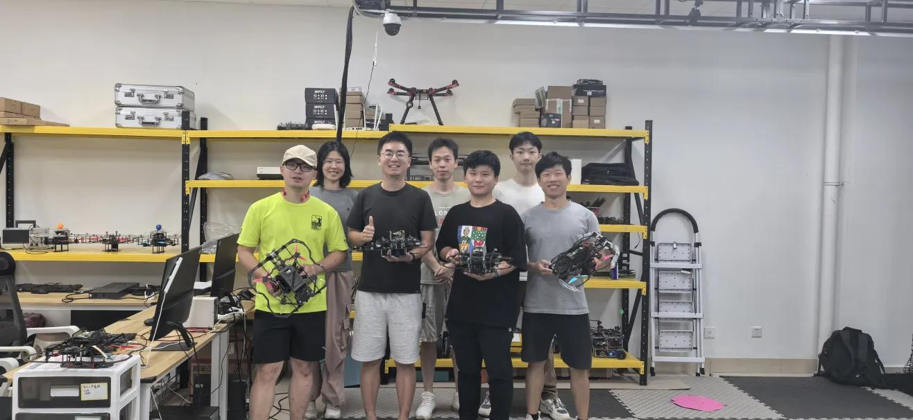
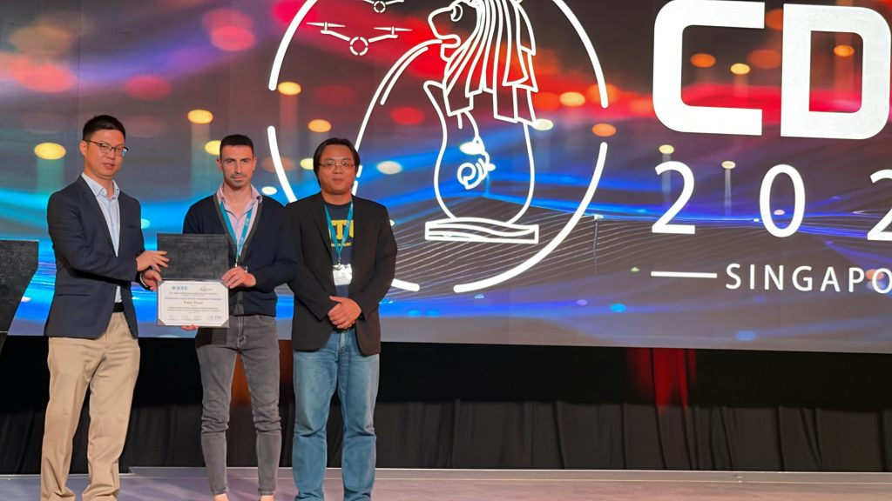

---
#
# By default, content added below the "---" mark will appear in the home page
# between the top bar and the list of recent posts.
# To change the home page layout, edit the _layouts/home.html file.
# See: https://jekyllrb.com/docs/themes/#overriding-theme-defaults
#
layout: home
title: Cooperative Aerial Robots Inspection Challenge Leaderboards
permalink: /leaderboard/
---

## IROS 2024, Abu Dhabi

Congratulations to team **XMU MAC** for winning the CARIC at IROS 2024, Abu Dhabi!

Team **XMU MAC** Members: 
 1. Bangwei Zhao  
 2. Jiarui Guo 
 3. Xianglin Chen 
 4. Yiqun Wang 
 5. Can Tang 
 6. Liujuan Cao 
 7. Rongrong Ji 
 8. Xiao Yu 

<table class="tg" style="undefined;table-layout: fixed; width: 1000px"><colgroup>
<col style="width: 50px">
<col style="width: 100px">
<col style="width: 80px">
<col style="width: 600px">
</colgroup>
<thead>
  <tr>
    <th class="tg-k9d3">Rank</th>
    <th class="tg-k9d3">Team</th>
    <th class="tg-k9d3">Score</th>
    <th class="tg-0lax" rowspan="6">  </th>
  </tr>
  <tr>
    <th class="tg-kh82">1</th>
    <th class="tg-kh82">XMU MAC</th>
    <th class="tg-kh82">16331.856</th>
  </tr>
  <tr>
    <th class="tg-m557">2</th>
    <th class="tg-m557">KIOS CoE</th>
    <th class="tg-m557">15280.395</th>
  </tr>
  <tr>
    <th class="tg-kh82">3</th>
    <th class="tg-kh82">HBW</th>
    <th class="tg-kh82">11280.563</th>
  </tr>
  <tr>
    <th class="tg-m557">4</th>
    <th class="tg-m557">HKU-TRANSGP </th>
    <th class="tg-m557">11063.355</th>
  </tr>
  <tr>
    <th class="tg-kh82">5</th>
    <th class="tg-kh82">Explore-bots</th>
    <th class="tg-kh82" rowspan="6">17.092</th>
  </tr></thead>
</table>

## CDC 2023, Singapore:

Congratulations to team **CyCLOPS** for winning the CARIC at CDC 2023 Singapore!

Team **CyCLOPS** Members:  
1. Mr. Angelos Zacharia  
2. Mr. Andreas Anastasiou  
3. Dr. Savvas Papaioannou  
4. Research Assistant Professor Panayiotis Kolios  
5. Prof. Christos G. Panayiotou  
6. Prof. Marios M. Polycarpou  

<table class="tg" style="undefined;table-layout: fixed; width: 1000px"><colgroup>
<col style="width: 50px">
<col style="width: 100px">
<col style="width: 80px">
<col style="width: 600px">
</colgroup>
<thead>
  <tr>
    <td class="tg-k9d3">Rank</td>
    <td class="tg-k9d3">Team</td>
    <td class="tg-k9d3">Score</td>
    <td class="tg-0lax" rowspan="7">  </td>
  </tr>
  <tr>
    <td class="tg-kh82">1</td>
    <td class="tg-kh82">CyCLOPS</td>
    <td class="tg-kh82">4559.802</td>
  </tr>
  <tr>
    <td class="tg-m557">2</td>
    <td class="tg-m557">XXH</td>
    <td class="tg-m557">3863.138</td>
  </tr>
  <tr>
    <td class="tg-kh82">3</td>
    <td class="tg-kh82">STAR</td>
    <td class="tg-kh82">3105.896</td>
  </tr>
  <tr>
    <td class="tg-m557">4</td>
    <td class="tg-m557">XMU</td>
    <td class="tg-m557">2704.406</td>
  </tr>
  <tr>
    <td class="tg-kh82">5</td>
    <td class="tg-kh82">GDUT</td>
    <td class="tg-kh82">2144.757</td>
  </tr>
  <tr>
    <td class="tg-smba">6</td>
    <td class="tg-smba">Undisclosed</td>
    <td class="tg-smba">143.412</td>
  </tr></thead></table>

  [Return to Home](/)